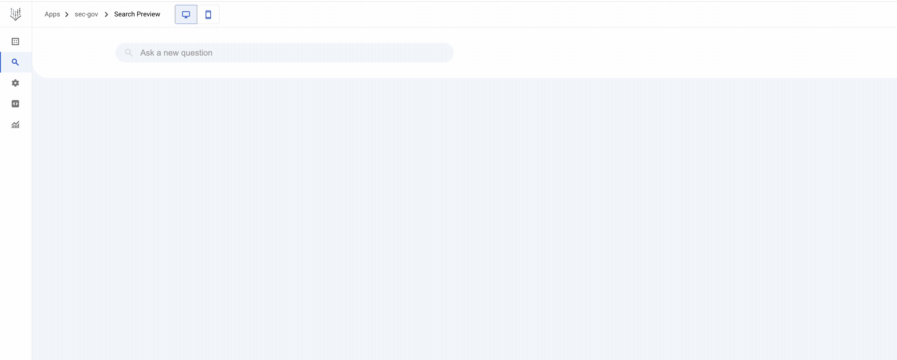

### Vertex AI Search Service

### Cloud Functions to call Vertex AI Search Service and exposed as a webhook

### Dialogflow webhook to call Cloud Functions(local function)
(As is results from Vertex AI Search Service)

### Dialogflow webhook to call Cloud Functions
(As is results from Vertex AI Search Service)

Ensure you have given service-your-agent-project-number@gcp-sa-dialogflow.iam gserviceaccount.com account following roles: Cloud Function Invoker and Cloud Run Invoker roles